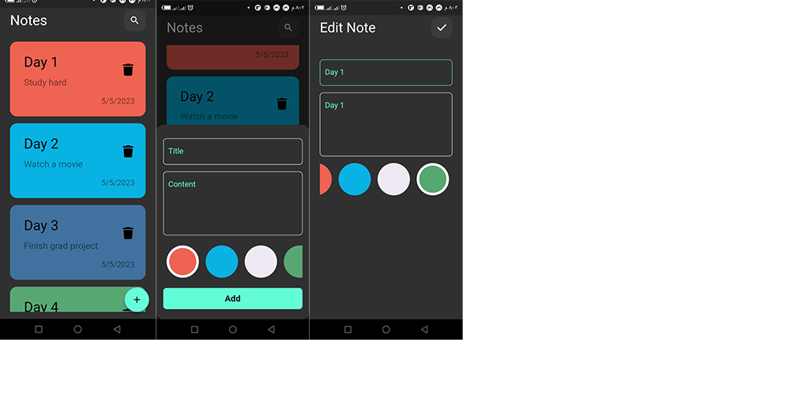

# Notes App using Flutter

---

### This is my first CRUD App using flutter, used hive for the local Data base and BloC for State management.

The user can create, read, update or delete a note and also pick different color for each note

---

#### IMAGES

